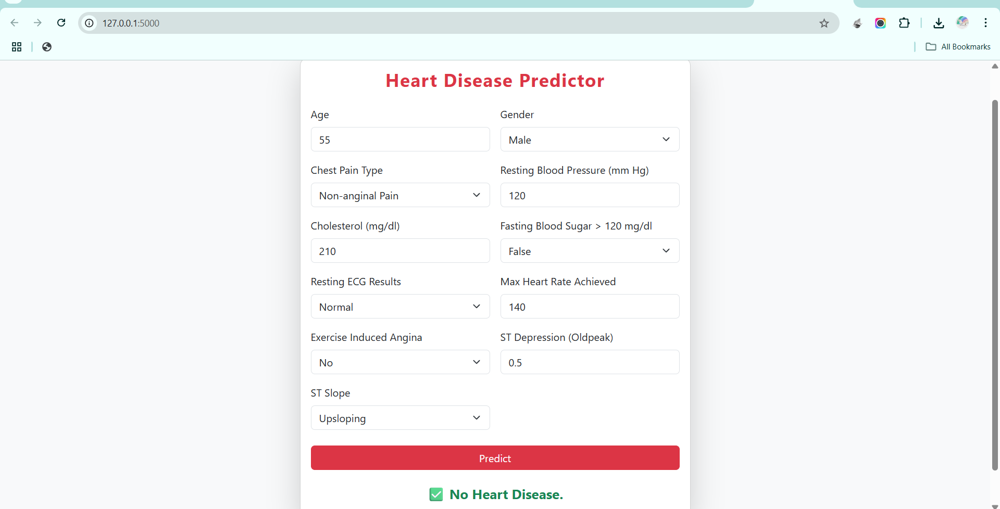

# Heart Disease Prediction

This project aims to predict the presence of heart disease in a patient using machine learning algorithms. It uses medical attributes to train models that assist healthcare professionals in making faster and more accurate diagnoses.

